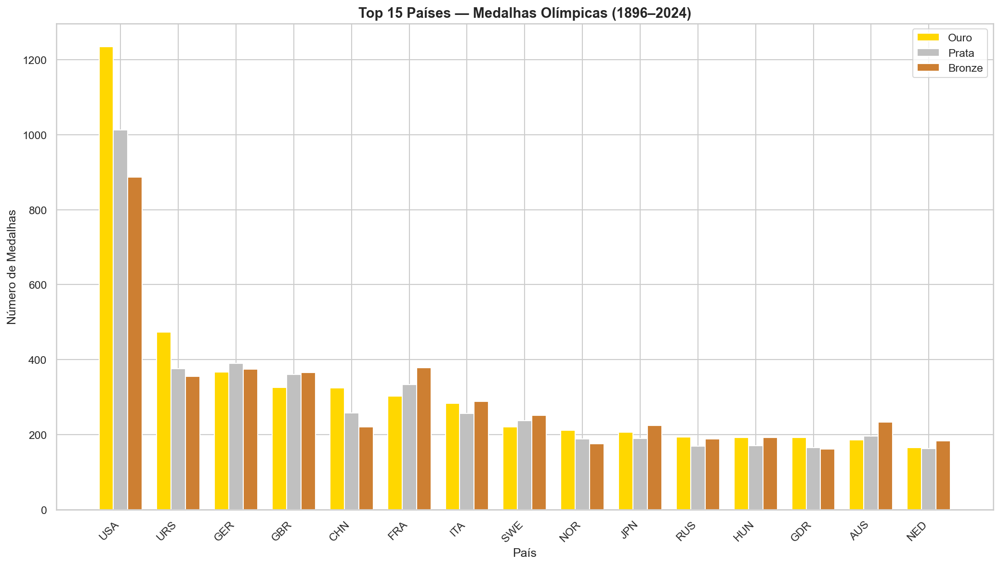
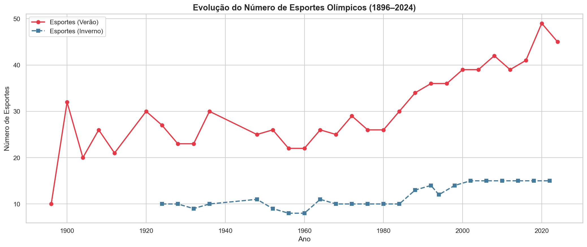
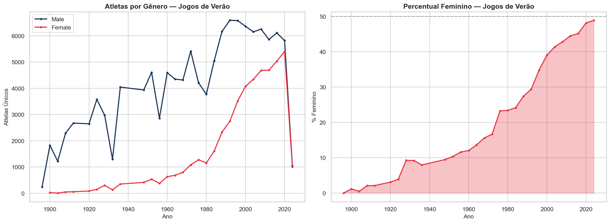

# 🏅 Olympic Data Lake — Pipeline de Dados Olímpicos

## Visão Geral

Este projeto implementa um **Data Lake estruturado** para dados olímpicos, cobrindo desde os primeiros Jogos Olímpicos modernos (1896) até as Olimpíadas de Paris 2024.

O pipeline segue a arquitetura de camadas **RAW → BRONZE → PRATA (SILVER) → GOLD**, aplicando boas práticas de engenharia de dados para garantir reprodutibilidade, rastreabilidade e qualidade.

---

## 🏗️ Arquitetura — Camadas do Data Lake

| Camada | Descrição | Formato |
|--------|-----------|--------|
| **RAW** | Dados brutos originais sem transformação | CSV, JSON |
| **BRONZE** | Dados padronizados (snake_case, trimming, parquet) | Parquet, JSON |
| **PRATA** | Dados integrados (JOINs, deduplicação, curadoria) | Parquet, JSON |
| **GOLD** | Dados analíticos prontos para consumo (agregações, KPIs) | CSV, PNG, JSON |

---

## 📁 Estrutura de Pastas

```
olympics-datalake/
│
├── README.md                         # Este arquivo
├── metadata_schema.json              # Schema padrão para metadados
│
├── raw/                              # Dados brutos
│   ├── olympics_historico.csv
│   ├── olympics_paris2024.csv
│   ├── olympics_historico.json
│   ├── olympics_paris2024.json
│   ├── medal_tally_historico.csv
│   ├── result_historico.csv
│   ├── medals_paris2024.csv
│   └── *_metadata.json
│
├── bronze/                           # Dados padronizados
│   ├── *.parquet
│   └── *_metadata.json
│
├── prata/                            # Dados integrados
│   ├── medalhas_1986_2024.parquet
│   ├── modalidades_1986_2024.parquet
│   ├── atletas_por_sexo.parquet
│   └── *_metadata.json
│
└── gold/                             # Dados analíticos
    ├── analise_medalhas/
    │   ├── medalhas_summary.csv
    │   ├── medalhas_plot.png
    │   └── metadata.json
    ├── analise_modalidades/
    │   ├── modalidades_summary.csv
    │   ├── modalidades_plot.png
    │   └── metadata.json
    └── analise_genero/
        ├── genero_summary.csv
        ├── genero_plot.png
        └── metadata.json
```

---

## 🛠️ Tecnologias Utilizadas

- **Python 3.8+**
- **pandas** — Manipulação e análise de dados
- **pyarrow** — Leitura/escrita de arquivos Parquet
- **matplotlib / seaborn** — Visualizações
- **pathlib / os** — Gerenciamento de caminhos e diretórios
- **json** — Metadados estruturados
- **Jupyter Notebook** — Documentação executável

---

## 🚀 Como Executar

1. **Pré-requisitos**:
   ```bash
   pip install pandas pyarrow matplotlib seaborn
   ```

2. **Estrutura esperada de dados de entrada**:
   ```
   raw/
   ├── 1986-2022/
   │   ├── world_olympedia_olympics_athlete_event_result.csv
   │   ├── world_olympedia_olympics_game_medal_tally(4).csv
   │   └── world_olympedia_olympics_result(2).csv
   └── 2024/
       ├── medallists.csv
       └── medals(1).csv
   ```

3. **Executar o notebook**:
   ```bash
   jupyter notebook datalake_pipeline.ipynb
   ```
   Execute todas as células sequencialmente. O pipeline é **idempotente** — pode ser re-executado sem efeitos colaterais.

---

## 📊 Fontes de Dados

| Dataset | Fonte | Período | Descrição |
|---------|-------|---------|----------|
| athlete_event_result | Olympedia | 1896–2022 | Resultados individuais de atletas em eventos olímpicos |
| game_medal_tally | Olympedia | 1896–2022 | Quadro de medalhas por país e edição |
| result | Olympedia | 1896–2022 | Detalhes de eventos (local, formato, descrição) |
| medallists | Kaggle | 2024 | Medalhistas de Paris 2024 (individual) |
| medals | Kaggle | 2024 | Medalhas de Paris 2024 (agregado por evento) |

---

## 📈 Exemplos de Saídas

### Top 15 Países por Medalhas (1896–2024)


### Evolução dos Esportes Olímpicos


### Participação por Gênero ao Longo do Tempo


---

## 📋 Metadados

Cada dataset possui um arquivo `*_metadata.json` com informações de:
- Schema (colunas e tipos)
- Fonte dos dados
- Transformações aplicadas
- Contagem de linhas
- Data de processamento
- Lógica de agregação/JOIN (quando aplicável)

O schema padrão está definido em `metadata_schema.json`.
